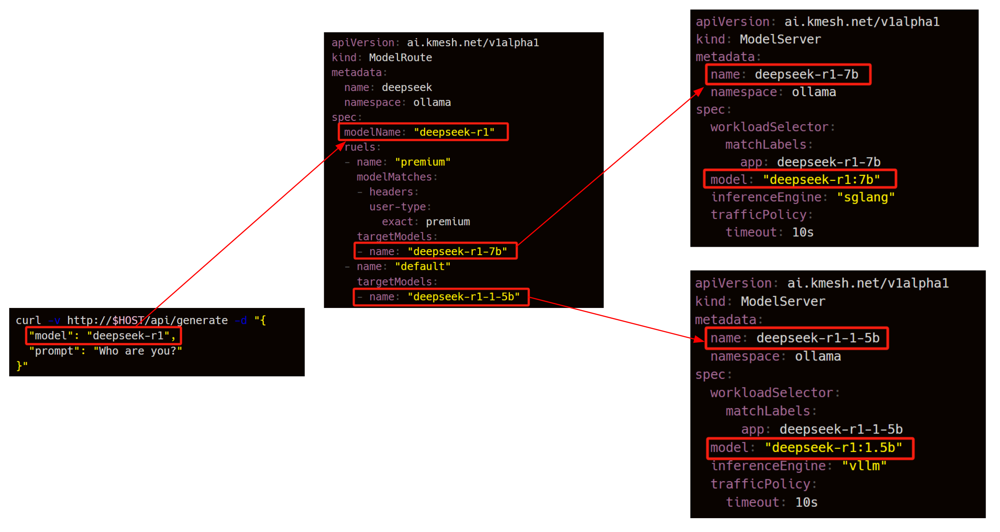

# AIEngine
AI Gateway Engine of Kmesh.

Only POC, to be merged into the main repo later.

Architecture:

Base Model Route:

Model Adapter Route:

### Features

- All in one binary, lightweight, minimal dependencies, user-friendly and easy to deploy.

- Seamlessly compatible with various gateway infrastructures, whether based on Nginx, Envoy, or others.

- Model Aware Routing based on metrics fetched from inference engine to enable better scheduling of AI traffic and enhances inference performance.

- Lora Aware Load Balancing

- Rich Load Balancing Algorithms: Session Affinity, Pefix Cache aware, KV Cache aware, Heterogeneous GPU hardware aware ...

- Inference Engine Agnostic, compatible with mainstream frameworks such as vLLM, SGLang, TGI, and more.

- Model Canary release or A/B testing

- Authentication, Authorization and Rate Limiting by tokens

- Support Gateway API and inference API from Kubernetes Community

...
